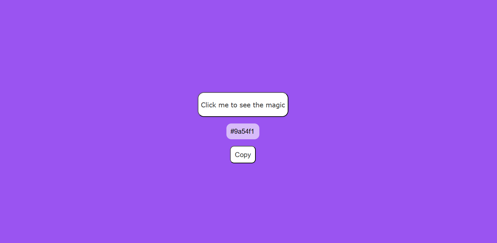

# 🎨 Random Color Generator

A simple web app that generates random colors and displays their hex codes.

## 🚀 Live Demo
[Click here to view](https://hrveekshith.github.io/random-color-generator/)

## 🛠️ Built With
- HTML
- CSS
- JavaScript

## 📸 Preview
 

## 📂 How to Use
1. Click the button to generate a random color.
2. Copy the hex code and use it anywhere!

## 📜 License
This project is open source under the MIT license.

